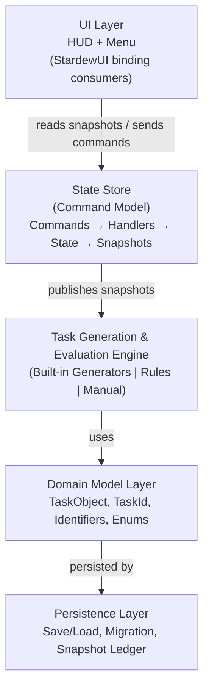

# Joja AutoTasks — Architecture Map

## Purpose

This document provides a **code-level implementation map** of the Joja AutoTasks architecture, supplementing the design guide with concrete class names, method signatures, and data flow patterns.

Use this map to:

- Understand how conceptual design sections map to actual code structure
- Navigate the codebase when implementing or debugging features
- Identify relationships between architectural layers
- Locate key classes and methods for specific functionality
- Understand data flow through the system

This is a **developer reference document** focused on implementation details. For conceptual architecture and design rationale, see the primary design guide sections in `Project/Planning/Joja AutoTasks Design Guide/`.

## Document Conventions

### Cross-References

This document references design guide sections using the format:

- **[Section N]** — refers to Section N in the design guide

### Code References

- `ClassName` — refers to an implemented or planned class
- `MethodName()` — refers to a method signature
- `PropertyName` — refers to a property
- **Namespace.ClassName** — fully qualified type when needed for clarity

## Table of Contents

1. [System Overview](#1-system-overview)
2. [Architectural Layers](#2-architectural-layers)
3. [Core Identifiers](#3-core-identifiers)
4. [Domain Model](#4-domain-model)
5. [State Store Architecture](#5-state-store-architecture)
6. [Task Generation & Evaluation](#6-task-generation--evaluation)
7. [Persistence Layer](#7-persistence-layer)
8. [UI Binding Model](#8-ui-binding-model)
9. [Lifecycle Coordination](#9-lifecycle-coordination)
10. [Event System](#10-event-system)
11. [Configuration System](#11-configuration-system)
12. [Data Flow Summary](#12-data-flow-summary)
13. [Implementation Status](#13-implementation-status)

## 1. System Overview

### 1.1 High-Level Architecture

Joja AutoTasks follows a **layered architecture** with clear separation of concerns:



### 1.2 Key Architectural Principles

**Determinism**  
Task identifiers and evaluation results remain stable across save loads and evaluations. See **[Section 3]** for identifier model details.

**Immutability**  
Domain objects (TaskObject, identifiers) are immutable value types or records. State mutations occur only through State Store commands.

**Command Pattern**  
State changes flow through commands processed by command handlers, never direct mutation. See **[Section 8]** for State Store command model.

**Snapshot Isolation**  
UI systems receive read-only snapshots, preventing accidental state corruption. See **[Section 10]** for UI binding model.

**Constructor Injection**  
Dependencies are wired via constructor parameters, enabling unit testing and clear dependency graphs. See **[Section 2.4]** for subsystem composition.

---

## 2. Architectural Layers

### 2.1 Entry & Lifecycle Layer

**Purpose:** SMAPI integration, game event subscription, and lifecycle coordination.

#### Key Classes

**`ModEntry`** (namespace: `JojaAutoTasks`)

- **Inheritance:** `StardewModdingAPI.Mod`
- **Purpose:** SMAPI entrypoint and game event forwarding
- **Location:** `ModEntry.cs`

**Key Methods:**

```csharp
public override void Entry(IModHelper helper)
```

Initializes the mod runtime via `BootstrapContainer.Build()` and subscribes to SMAPI events.

**Event Handlers:**

```csharp

private void OnGameLaunched(object? sender, GameLaunchedEventArgs e)
private void OnSaveLoaded(object? sender, SaveLoadedEventArgs e)
private void OnDayStarted(object? sender, DayStartedEventArgs e)
private void OnReturnedToTitle(object? sender, ReturnedToTitleEventArgs e)
private void OnSaving(object? sender, SavingEventArgs e)
private void OnUpdateTicked(object? sender, UpdateTickedEventArgs e)
```

Each forwards to `LifecycleCoordinator.Handle{Event}()`.

**Throttling:**

```csharp
private bool ShouldForwardUpdateTick(uint currentTick)
```

Throttles `UpdateTicked` to once every 6 seconds (360 ticks) to avoid performance cost.

---

**`BootstrapContainer`** (namespace: `JojaAutoTasks.Startup`)

- **Purpose:** Composition root — builds dependency graph and wires all subsystems
- **Location:** `Startup/BootstrapContainer.cs`

**Key Methods:**

```csharp
internal static ModRuntime Build(IModHelper helper, IMonitor monitor)
```

Constructs and returns `ModRuntime` with all dependencies initialized:

1. Creates `ModLogger`
2. Loads `ModConfig` via `ConfigLoader`
3. Instantiates `EventDispatcher`
4. Instantiates `LifecycleCoordinator`
5. Returns composed `ModRuntime`

---

**`ModRuntime`** (namespace: `JojaAutoTasks.Startup`)

- **Purpose:** Runtime container holding all major subsystem references
- **Location:** `Startup/ModRuntime.cs`

**Properties:**

```csharp
public ModLogger Logger { get; }
public ModConfig Config { get; }
public IEventDispatcher EventDispatcher { get; }
public LifecycleCoordinator LifecycleCoordinator { get; }
```

---

**`LifecycleCoordinator`** (namespace: `JojaAutoTasks.Lifecycle`)

- **Purpose:** Coordinates lifecycle signal sequencing and forwards events to `EventDispatcher`
- **Location:** `Lifecycle/LifecycleCoordinator.cs`

**Constructor:**

```csharp
internal LifecycleCoordinator(ModLogger logger, IEventDispatcher eventDispatcher)
```

**Key Methods:**

```csharp
internal void HandleGameLaunched()
internal void HandleSaveLoaded()
internal void HandleDayStarted()
internal void HandleReturnedToTitle()
internal void HandleSavingInProgress()
internal void HandleUpdateTicked(bool isDebugMode)
```

Each method logs the event and forwards to the `EventDispatcher` for downstream processing.

**Related Design Guide:** **[Section 2.5]** — Event Flow (Mod Lifecycle)

---

### 2.2 Event System Layer

**Purpose:** Decouple lifecycle coordination from runtime processors.

#### Event Dispatch Contract

**`IEventDispatcher`** (namespace: `JojaAutoTasks.Events`)

- **Purpose:** Contract for lifecycle event dispatch
- **Location:** `Events/IEventDispatcher.cs`

**Methods:**

```csharp
void DispatchGameLaunched();
void DispatchSaveLoaded();
void DispatchDayStarted();
void DispatchReturnedToTitle();
void DispatchSavingInProgress();
void DispatchUpdateTicked();
```

---

**`EventDispatcher`** (namespace: `JojaAutoTasks.Events`)

- **Purpose:** Implements lifecycle dispatch contract (currently no-op in Phase 1)
- **Location:** `Events/EventDispatcher.cs`
- **Current Status:** **Phase 1 stub** — all methods are no-ops pending Phase 2+ runtime wiring

**Future Behavior (Phase 2+):**

Will route events to:

- State Store for evaluation triggers
- Persistence layer for save/load operations
- UI systems for refresh notifications

---

### 2.3 Configuration Layer

**Purpose:** Load and manage mod configuration from `config.json`.

#### Configuration Components

**`ModConfig`** (namespace: `JojaAutoTasks.Configuration`)

- **Purpose:** Persisted configuration schema
- **Location:** `Configuration/ModConfig.cs`

**Properties:**

```csharp
public int ConfigVersion { get; set; } = 1;
public bool EnableMod { get; set; } = true;
public bool EnableDebugMode { get; set; } = false;
```

**Versioning:**

```csharp
public const int CurrentConfigVersion = 1;
```

---

**`ConfigLoader`** (namespace: `JojaAutoTasks.Configuration`)

- **Purpose:** Loads config from file, applies migrations, handles defaults
- **Location:** `Configuration/ConfigLoader.cs`

**Constructor:**

```csharp
public ConfigLoader(IModHelper helper)
```

**Key Methods:**

```csharp
public ModConfig Load()
```

Loads config via SMAPI's `Helper.ReadConfig<ModConfig>()` with safe defaults.

---

### 2.4 Domain Model Layer

**Purpose:** Pure data structures representing tasks, identifiers, and statuses.

See **[Section 4: Domain Model](#4-domain-model)** for detailed breakdown.

---

### 2.5 State Store Layer

**Purpose:** Authoritative in-memory task state with command-based mutations.

See **[Section 5: State Store Architecture](#5-state-store-architecture)** for details.

**Status:** Planned for Phase 2+

---

### 2.6 Task Engine Layer

**Purpose:** Generate and evaluate tasks from all sources (built-in, Task Builder, manual).

See **[Section 6: Task Generation & Evaluation](#6-task-generation--evaluation)** for details.

**Status:** Planned for Phase 2+

---

### 2.7 Persistence Layer

**Purpose:** Save/load mod data, manage versioning and migrations.

See **[Section 7: Persistence Layer](#7-persistence-layer)** for details.

**Status:** Planned for Phase 2+

---

### 2.8 UI Layer

**Purpose:** HUD and menu rendering via StardewUI, consuming State Store snapshots.

See **[Section 8: UI Binding Model](#8-ui-binding-model)** for details.

**Status:** Planned for Phase 2+

---

## 3. Core Identifiers

All identifier types follow the **deterministic identifier model** defined in **[Section 3]**.

### 3.1 TaskId

**Purpose:** Unique, deterministic identifier for a task instance.

**Namespace:** `JojaAutoTasks.Domain.Identifiers`  
**Location:** `Domain/Identifiers/TaskId.cs`  
**Type:** `readonly struct`

**Constructor:**

```csharp
public TaskId(string taskId)
```

Validates and normalizes the identifier string via `IdentifierUtility`.

**Properties:**

```csharp
public string Value { get; }
```

**Interface Implementations:**

- `IEquatable<TaskId>`

**Key Methods:**

```csharp
public bool Equals(TaskId other)
public override int GetHashCode()
public override string ToString()
```

**Equality Semantics:**

Uses `StringComparer.Ordinal` for case-sensitive, culture-invariant comparison.

**Validation:**

- Must not be null, empty, or whitespace after normalization
- Enforced via `IdentifierUtility.ValidateIdentifier()`

**Conceptual Structure (from [Section 3.3]):**

```text
TaskId = {SourcePrefix}_{StableSourceId}_{SubjectIdentifier?}_{DayKey?}
```

**Examples:**

- `BuiltIn_WaterCrops_Farm1_Year1-Summer15`
- `TaskBuilder_CustomRule42_NPC_Abigail_Year1-Summer15`
- `Manual_3`

---

### 3.1A TaskIdFactory

**Purpose:** Deterministic composition helper for canonical `TaskId` values.

**Namespace:** `JojaAutoTasks.Domain.Identifiers`  
**Location:** `Domain/Identifiers/TaskIdFactory.cs`  
**Type:** `internal static class`

**Key Methods:**

```csharp
public static TaskId CreateBuiltIn(string generatorId, string? subjectIdentifier = null, DayKey? dayKey = null)
public static TaskId CreateTaskBuilder(string ruleId, string? subjectIdentifier = null, DayKey? dayKey = null)
```

**Behavior Notes:**

- Uses stable source prefixes (`BuiltIn`, `TaskBuilder`)
- Preserves deterministic part ordering when composing IDs
- Omits null/empty optional parts before joining with `_`
- Manual TaskIds use canonical `Manual_{Counter}` shape (issuance deferred to Phase 3)
- Returns validated `TaskId` instances

---

### 3.2 DayKey

**Purpose:** Deterministic identifier for a game day.

**Namespace:** `JojaAutoTasks.Domain.Identifiers`  
**Location:** `Domain/Identifiers/DayKey.cs`  
**Type:** `readonly struct`

**Constructor:**

```csharp
public DayKey(string dayKey)
```

**Properties:**

```csharp
public string Value { get; }
```

**Format (from [Section 3.6]):**

```text
DayKey = Year{N}-{Season}{D} (e.g., "Year1-Summer15")
```

**Key Characteristics:**

- Stable across save loads
- Uses fixed non-localized season tokens with invariant casing
- Used for task creation timestamps and snapshot ledger keys

---

### 3.3 RuleId

**Purpose:** Unique identifier for a Task Builder rule.

**Namespace:** `JojaAutoTasks.Domain.Identifiers`  
**Location:** `Domain/Identifiers/RuleId.cs`  
**Type:** `readonly struct`

**Constructor:**

```csharp
public RuleId(string ruleId)
```

**Properties:**

```csharp
public string Value { get; }
```

**Model (from [Section 3.7]):**

- `RuleId` is a deterministic canonical token assigned to each Task Builder rule.
- Pre-Step-7 status: `RuleId` is implemented as a validated wrapper value type.
- Sequential-generation enforcement is deferred until RuleId generation exists.

**Stability Requirement:**

RuleId must remain stable across:

- Save loads
- Configuration changes
- Mod version upgrades

---

### 3.4 SubjectId

**Purpose:** Optional identifier for the target entity of a task (e.g., NPC, crop, location).

**Namespace:** `JojaAutoTasks.Domain.Identifiers`  
**Location:** `Domain/Identifiers/SubjectId.cs`  
**Type:** `readonly struct`

**Constructor:**

```csharp
public SubjectId(string subjectId)
```

**Properties:**

```csharp
public string Value { get; }
```

**Examples (from [Section 3.5]):**

- `NPC_Abigail` — for social tasks
- `Crop_Parsnip_Farm1` — for farming tasks
- `Location_Mine_Floor50` — for exploration tasks

**Usage:**

SubjectId is embedded in TaskId when tasks target specific entities, ensuring unique task instances per subject.

---

### 3.5 IdentifierUtility

**Purpose:** Shared validation and normalization logic for all identifier types.

**Namespace:** `JojaAutoTasks.Domain.Identifiers`  
**Location:** `Domain/Identifiers/IdentifierUtility.cs`  
**Type:** `static class`

**Key Methods:**

```csharp
public static string NormalizeIdentifier(string rawId)
```

Trims whitespace and applies normalization rules.

```csharp
public static void ValidateIdentifier(string normalizedId)
```

Throws `ArgumentException` if the identifier is null, empty, or invalid.

**Validation Rules:**

- Must not be null or empty after normalization
- Must not contain only whitespace
- Length constraints (if defined)
- Character restrictions (if defined)

---

## 4. Domain Model

The domain model layer contains **pure data structures** with no SMAPI or game dependencies.

**Related Design Guide:** **[Section 4]** — Core Data Model

---

### 4.1 TaskObject

**Purpose:** Immutable representation of a task instance.

**Namespace:** `JojaAutoTasks.Domain.Tasks`  
**Location:** `Domain/Tasks/TaskObject.cs`  
**Type:** `sealed class`

**Properties:**

```csharp
public TaskId Id { get; }
public TaskCategory Category { get; }
public TaskSourceType SourceType { get; }
public string Title { get; }
public string? Description { get; }
public TaskStatus Status { get; }
public int ProgressCurrent { get; }
public int ProgressMax { get; }
public DayKey CreationDay { get; }
public DayKey? CompletionDay { get; }
public string SourceIdentifier { get; }
```

**Constructor:**

```csharp
public TaskObject(
    TaskId id,
    TaskCategory category,
    TaskSourceType sourceType,
    string title,
    string? description,
    TaskStatus status,
    int progressCurrent,
    int progressMax,
    DayKey creationDay,
    DayKey? completionDay,
    string sourceIdentifier
)
```

**Validation (in constructor):**

- Title must not be null or whitespace
- SourceIdentifier must not be null or whitespace
- ProgressCurrent ≥ 0
- ProgressMax > 0
- If Status == Completed:
  - CompletionDay must be provided
  - ProgressCurrent ≥ ProgressMax
- If Status == Incomplete:
  - CompletionDay must be null

**Immutability:**

All properties are `{ get; }` only — no setters. State changes require creating a new `TaskObject`.

**Related Design Guide:** **[Section 4.2]** — Task Object Model

---

### 4.2 TaskStatus

**Purpose:** Enumeration of task completion states.

**Namespace:** `JojaAutoTasks.Domain.Tasks`  
**Location:** `Domain/Tasks/TaskStatus.cs`  
**Type:** `enum`

**Values (Phase 1):**

```csharp
public enum TaskStatus
{
    Incomplete = 0,
    Completed = 1
}
```

**Future Extensions (Phase 2+):**

- `Dismissed`
- `Hidden`
- `Failed`
- `Snoozed`

**Related Design Guide:** **[Section 4.3]** — Task Status

---

### 4.3 TaskCategory

**Purpose:** Fixed category enumeration for task organization.

**Namespace:** `JojaAutoTasks.Domain.Tasks`  
**Location:** `Domain/Tasks/TaskCategory.cs`  
**Type:** `internal enum`

**Values:**

```csharp
internal enum TaskCategory
{
    Farming,
    Animals,
    Machines,
    Social,
    Exploration,
    Resources,
}
```

**Usage:**

Used for:

- Menu organization
- HUD grouping (optional)
- Statistical analysis

**Related Design Guide:** **[Section 4.5]** — Task Categories

---

### 4.4 TaskSourceType

**Purpose:** Identifies the origin of a task.

**Namespace:** `JojaAutoTasks.Domain.Tasks`  
**Location:** `Domain/Tasks/TaskSourceType.cs`  
**Type:** `enum`

**Values:**

```csharp
public enum TaskSourceType
{
    BuiltIn,     // Automatic task from built-in generator
    TaskBuilder, // Task derived from Task Builder rule
    Manual       // Player-created manual task
}
```

**Usage:**

- Determines evaluation behavior
- Affects persistence strategy
- Influences UI presentation
- `TaskSourceType.Manual` maps to `Manual` as the canonical TaskId source prefix

**Related Design Guide:** **[Section 5.2]** — Task Sources and Engine Inputs

---

### 4.5 Progress Model

**Philosophy (from [Section 4.4.1]):**

**Progress fields are tracking metrics only.**

`ProgressCurrent` and `ProgressTarget` serve:

- Progress tracking for display
- HUD/UI progress bar rendering
- Support for rule evaluation logic

**Critical Invariant:**

> **Progress saturation does not imply automatic task completion.**

Task completion is determined by the task's **completion condition**, not solely by whether `ProgressCurrent >= ProgressMax`.

**Example:**

```text
Task: Gather 300 wood to build a Coop
ProgressCurrent: 305
ProgressMax: 300
Status: Incomplete

Reason: The player must still build the Coop. Progress saturation alone does
not satisfy the task's completion condition.
```

This design allows tasks to track progress independently from completion logic, supporting complex multi-step goals.

---

## 5. State Store Architecture

**Purpose:** Authoritative in-memory task state with command-based mutations.

**Related Design Guide:** **[Section 8]** — State Store Command Model

**Status:** Implemented in Phase 3 foundation

---

### 5.1 Architecture (Implemented)

The State Store follows a **Command → Command Handler → State** model:

```text
Command (intent)
    ↓
Command handler (deterministic transformation)
    ↓
State Mutation
    ↓
Snapshot Published (read-only view)
```

**Key Properties:**

- **Single Source of Truth:** Canonical task state lives here
- **Controlled Mutation:** Only commands can modify state
- **Snapshot Isolation:** External systems receive immutable snapshots
- **Deterministic Handlers:** Same input + same state yields same output

---

### 5.2 Implemented Components

#### StateStore

**Purpose:** Public mutation boundary and snapshot publication surface.

**Location:** `State/StateStore.cs`

**Implemented responsibilities:**

- Routes `IStateCommand` instances to concrete handlers
- Publishes `SnapshotChanged` when state version changes
- Runs day-boundary expiration cleanup on `OnDayStarted(DayKey)`
- Issues deterministic manual IDs via `TaskIdFactory.CreateManual(int)`

**Key methods:**

```csharp
internal void Dispatch(IStateCommand command)
internal void OnDayStarted(DayKey newDay)
internal void DispatchCreateManualTaskCommand(...)
```

---

#### StateContainer

**Purpose:** Internal canonical storage with deterministic version tracking.

**Location:** `State/StateContainer.cs`

**Structure:**

```csharp
private readonly Dictionary<TaskId, TaskRecord> _tasksMap;
private long _version;
```

**Key behavior:**

- `Set` / `Remove` increment version
- `Clear` resets state and version
- External consumers do not receive mutable dictionary access

---

#### Commands and Handlers

**Purpose:** Represent mutation intent and apply deterministic state transitions.

**Locations:**

- `State/Commands/`
- `State/Handlers/`

**Implemented command contract:**

```csharp
internal interface IStateCommand
{
    TaskId TaskId { get; }
}
```

**Implemented handler contract:**

```csharp
internal interface ICommandHandler<TCommand> where TCommand : IStateCommand
{
    void Handle(TCommand command, StateContainer state);
}
```

**Implemented command set:**

- `AddOrUpdateTaskCommand`
- `CompleteTaskCommand`
- `UncompleteTaskCommand`
- `RemoveTaskCommand`
- `PinTaskCommand`
- `UnpinTaskCommand`

---

#### TaskRecord

**Purpose:** Mutable internal task state structure.

**Location:** `State/Models/TaskRecord.cs`

**Implemented field groups:**

```csharp
internal sealed class TaskRecord
{
    // Identity
    internal TaskId Id { get; }

    // Engine-owned
    internal TaskCategory Category { get; }
    internal TaskSourceType SourceType { get; }
    internal string Title { get; set; }
    internal string? Description { get; set; }
    internal string SourceIdentifier { get; }
    internal int ProgressCurrent { get; set; }
    internal int ProgressMax { get; }
    internal DayKey CreationDay { get; }

    // User-owned
    internal bool IsPinned { get; set; }

    // Completion state
    internal TaskStatus Status { get; set; }
    internal DayKey? CompletionDay { get; set; }
}
```

Field ownership is enforced in handlers so engine updates preserve user state and user updates preserve engine state where applicable.

---

#### TaskSnapshot

**Purpose:** Read-only projection of task state for UI consumption.

**Location:** `State/Models/TaskSnapshot.cs`

**Implemented shape:**

```csharp
internal sealed class TaskSnapshot
{
    internal IReadOnlyList<TaskView> TaskViews { get; }
    internal long Version { get; }
}
```

Snapshots are projected via `SnapshotProjector` and published after version-changing mutations.

**Related Design Guide:** **[Section 8.5]** — Immutable Snapshot Model

---

#### Day-Boundary Cleanup

**Purpose:** Deterministic expiration detection and removal of expired day-scoped tasks.

**Locations:**

- `State/DayBoundary/ExpirationDetector.cs`
- `State/DayBoundary/DayTransitionHandler.cs`

**Behavior:**

- `ExpirationDetector` selects expired TaskIds from canonical state
- `DayTransitionHandler` removes them via `RemoveTaskCommandHandler`
- `StateStore.OnDayStarted(DayKey)` publishes a fresh snapshot if state changed

---

### 5.3 Command Flow Example

**Scenario:** User completes a task from the HUD.

**Flow:**

1. UI emits `CompleteTaskCommand` with target `TaskId`
2. State Store receives command
3. `CompleteTaskCommandHandler` validates task existence
4. Handler updates `TaskRecord` with `Status = Completed` and `CompletionDay = today`
5. State Store updates internal dictionary
6. State Store publishes new `TaskSnapshot`
7. UI receives snapshot update and re-renders

**Invariants:**

- Command processing is **synchronous**
- Command handlers are **deterministic** (same input + same state → same output)
- No external state access within handlers

---

## 6. Task Generation & Evaluation

**Purpose:** Create and evaluate tasks from all sources.

**Related Design Guide:** **[Section 5]** — Task Generation and Evaluation Engine

**Status:** Planned for Phase 2+

---

### 6.1 Conceptual Architecture

The Task Engine unifies three task sources into a single pipeline:

```text
Built-in Generators ──┐
                      ├──→ Evaluation Context ──→ Task Pipeline ──→ State Store
Task Builder Rules ───┤
                      │
Manual Tasks ─────────┘
```

---

### 6.2 Evaluation Context (planned)

**Purpose:** Snapshot of game state used for deterministic task generation and evaluation.

**Related Design Guide:** **[Section 5.3]** — Generation and Evaluation Context

**Conceptual Structure:**

```csharp
public sealed class EvaluationContext
{
    public TimeContext Time { get; }
    public PlayerContext Player { get; }
    public InventoryContext Inventory { get; }
    public WorldContext World { get; }
    public FarmContext Farm { get; }
}
```

**Lazy Initialization:**

Each context slice is built on-demand and cached for the evaluation cycle:

```csharp
public TimeContext Time => _time ??= BuildTimeContext();
```

**Benefits:**

- Reduces repeated expensive lookups
- Enables unit testing with mock state
- Provides deterministic evaluation inputs
- Supports caching and throttling

---

### 6.3 Game State Abstraction (planned)

**Purpose:** Decouple engine logic from direct SMAPI/game API calls.

**Related Design Guide:** **[Section 5.3.1]** — Game State Abstraction

**Conceptual Interface:**

```csharp
public interface IGameStateProvider
{
    IReadOnlyList<Item> GetPlayerItems();
    IReadOnlyList<FarmAnimal> GetFarmAnimals();
    IReadOnlyList<GameLocation> GetLocations();
    int GetSkillLevel(SkillType skill);
    // ... domain-specific accessors
}
```

**Implementation:**

Concrete `GameStateProvider` wraps Stardew Valley / SMAPI API calls.

**Dependency Injection:**

Injected into `EvaluationContext` during mod initialization.

**Benefits:**

- Unit testing with mocked game state
- Deterministic evaluation isolated from game environment
- Clean separation between engine logic and SMAPI coupling

---

### 6.4 Built-in Task Generators (planned)

**Purpose:** Hardcoded generators for automatic task detection.

**Related Design Guide:** **[Section 5.4]** — Built-in Automatic Task Generators

**Conceptual Pattern:**

```csharp
public interface ITaskGenerator
{
    IEnumerable<TaskObject> Generate(EvaluationContext context);
}
```

**Example Generators (planned):**

```csharp
public class WaterCropsGenerator : ITaskGenerator
public class HarvestCropsGenerator : ITaskGenerator
public class FeedAnimalsGenerator : ITaskGenerator
public class CollectMachineOutputGenerator : ITaskGenerator
```

**Generator Characteristics:**

- **Stateless:** no mutable state inside generator
- **Deterministic:** same context → same tasks
- **Domain-focused:** each generator handles one gameplay area

**Usage:**

All generators are invoked during task evaluation cycle, producing a unified task list.

---

### 6.5 Task Builder Rules (planned)

**Purpose:** Player-authored rule-based task generation.

**Related Design Guide:** **[Section 6]** — Task Builder Rule Serialization,  
**[Section 7]** — Rule Evaluation Model

**Status:** Design specified, implementation deferred to Phase 3+

**Conceptual Flow:**

1. Player creates rule via Task Builder wizard UI
2. Rule serialized to `RuleDefinition` object
3. Rule persisted to save data
4. On evaluation cycle:
   - Rule evaluated against `EvaluationContext`
   - If conditions met, task generated
   - Task added to unified task list

**Key Components (planned):**

```csharp
public sealed class RuleDefinition
{
    public RuleId RuleId { get; }
    public RuleMetadata Metadata { get; }
    public TriggerConfiguration Trigger { get; }
    public ConditionTree Conditions { get; }
    public ProgressModel Progress { get; }
    public OutputModel Output { get; }
}
```

**Rule Evaluation Engine (planned):**

```csharp
public interface IRuleEvaluator
{
    IEnumerable<TaskObject> Evaluate(RuleDefinition rule, EvaluationContext context);
}
```

---

### 6.6 Manual Tasks (planned)

**Purpose:** Player-created tasks without rule logic.

**Characteristics:**

- Fully persisted (not derived from rules)
- No automatic evaluation
- Completion-marking structure exists, but runtime behavior is deferred
- Follows same `TaskObject` structure as generated tasks

**Lifecycle:**

1. Player creates task via UI
2. Task persisted to save data
3. Task loaded into State Store on save load
4. Task remains until completion/deletion command flow applies a state change

---

## 7. Persistence Layer

**Purpose:** Save/load mod data with versioning and migration support.

**Related Design Guide:** **[Section 9]** — Persistence Model

**Status:** Planned for Phase 2+

---

### 7.1 Persistence Principles

**Minimal Storage (from [Section 9.2]):**

Only essential state is saved. Derived fields are recomputed at runtime.

**Deterministic Reconstruction:**

Tasks from rules are recreated via evaluation, not stored directly.

**Version Safety:**

All save data includes schema version for migration logic.

**Separation of Concerns:**

Persistence layer does not store UI state or transient engine data.

---

### 7.2 SaveData Structure (planned)

**Conceptual Model:**

```csharp
public sealed class SaveData
{
    public int SaveSchemaVersion { get; set; }
    public List<RuleDefinition> TaskBuilderRules { get; set; }
    public List<ManualTaskRecord> ManualTasks { get; set; }
    public Dictionary<TaskId, RuleRuntimeData> RuleRuntimeData { get; set; }
    public StoreUserState StoreUserState { get; set; }
}
```

**Field Descriptions:**

**SaveSchemaVersion**  
Schema version for migration logic.

**TaskBuilderRules**  
Serialized `RuleDefinition` objects from Task Builder.

**ManualTasks**  
Player-created tasks (fully persisted).

**RuleRuntimeData**  
Runtime values for rule correctness (e.g., baselines).

**StoreUserState**  
User flags like pinned tasks, completion overrides.

**Related Design Guide:** **[Section 9.4]** — SaveData Structure

---

### 7.3 Rule Persistence (planned)

Task Builder rules are stored exactly as serialized (**[Section 6]**).

**On Save:**

1. Serialize active `RuleDefinition` objects
2. Write to save data

**On Load:**

1. Load rules from save data
2. Evaluation Engine reconstructs runtime rule objects
3. Rule evaluation generates tasks dynamically

**Critical Principle:**

> Tasks generated from rules are **not stored directly** — only the rule definitions are persisted.

---

### 7.4 Manual Task Persistence (planned)

Manual tasks are **fully stored** because they are not derived from rules.

**Conceptual Structure:**

```csharp
public sealed class ManualTaskRecord
{
    public TaskId TaskId { get; set; }
    public string Title { get; set; }
    public string? Description { get; set; }
    public TaskCategory Category { get; set; }
    public TaskStatus Status { get; set; }
    public int ProgressCurrent { get; set; }
    public int ProgressTarget { get; set; }
    public DayKey? Deadline { get; set; }
    public UserFlags UserFlags { get; set; }
}
```

**Lifecycle:**

1. Created by player
2. Persisted to `SaveData.ManualTasks`
3. Loaded into State Store on save load
4. Follows same `TaskRecord` structure as generated tasks

**Related Design Guide:** **[Section 9.6]** — Manual Task Persistence

---

### 7.5 Migration System (planned)

**Purpose:** Safely upgrade save data across mod versions.

**Related Design Guide:** **[Section 18]** — Versioning and Migration Strategy

**Conceptual Pattern:**

```csharp
public interface IMigrationPipeline
{
    SaveData Migrate(SaveData data, int fromVersion, int toVersion);
}
```

**Migration Chain:**

```csharp
public sealed class MigrationPipeline : IMigrationPipeline
{
    private readonly List<IMigration> _migrations;

    public SaveData Migrate(SaveData data, int fromVersion, int toVersion)
    {
        foreach (var migration in _migrations)
        {
            if (migration.TargetVersion > fromVersion && migration.TargetVersion <= toVersion)
            {
                data = migration.Apply(data);
            }
        }
        return data;
    }
}
```

**Example Migration:**

```csharp
public class MigrateV1ToV2 : IMigration
{
    public int TargetVersion => 2;

    public SaveData Apply(SaveData data)
    {
        // Transform data structure
        // Add new fields with defaults
        // Return migrated data
    }
}
```

---

### 7.6 Daily Snapshot Ledger (planned)

**Purpose:** Historical record of task state per day.

**Related Design Guide:** **[Section 11]** — Daily Snapshot Ledger

**Conceptual Structure:**

```csharp
public sealed class DailySnapshotLedger
{
    public Dictionary<DayKey, DailySnapshot> Snapshots { get; set; }
}

public sealed class DailySnapshot
{
    public DayKey Day { get; set; }
    public List<TaskSummary> Tasks { get; set; }
    public DailyStatistics Statistics { get; set; }
}
```

**Usage:**

- Enables task history browsing in UI
- Supports analytics and statistics (V2)
- Persisted separately from active task state

---

## 8. UI Binding Model

**Purpose:** UI rendering via StardewUI, consuming State Store snapshots.

**Related Design Guide:** **[Section 10]** — UI Data Binding Model,  
**[Section 10A]** — View Model Architecture

**Status:** Planned for Phase 2+

---

### 8.1 UI Interaction Principles

**Read-Only Data Access (from [Section 10.2]):**

UI components receive immutable snapshots of task data.

**Command-Based Mutations:**

User actions produce commands sent to State Store.

**Snapshot Rendering:**

UI renders the latest published snapshot of task state.

**Loose Coupling:**

UI does not reference Evaluation Engine or persistence systems.

---

### 8.2 Snapshot Subscription Model (planned)

**Conceptual Flow:**

```text
State Store
    ↓
Publish Snapshot
    ↓
UI Subscribers Receive Update
    ↓
UI Re-renders
```

**View Model Layer (from [Section 10A]):**

View Models receive snapshot change events, diff against current state, and update INPC properties so StardewUI's binding engine detects and renders changes automatically.

---

### 8.3 TaskView Structure (planned)

**Purpose:** UI-facing projection of a task.

**Conceptual Structure:**

```csharp
public sealed class TaskView
{
    public TaskId TaskId { get; }
    public string Title { get; }
    public string? Description { get; }
    public TaskCategory Category { get; }
    public TaskStatus Status { get; }
    public int ProgressCurrent { get; }
    public int ProgressTarget { get; }
    public DeadlineFields DeadlineFields { get; }
    public string Icon { get; }
    public UserFlags UserFlags { get; }

    // Derived fields for convenience
    public float ProgressPercent { get; }
    public int DaysRemaining { get; }
    public bool IsOverdue { get; }
}
```

**Note:** Progress fields are tracking metrics; completion determined by conditions (**[Section 4.4.1]**).

**Related Design Guide:** **[Section 10.4]** — Task View Structure

---

### 8.4 HUD Task Display (planned)

**Purpose:** Lightweight, always-available task tracker.

**Responsibilities (from [Section 2.1]):**

- Display active tasks for the day
- Support scrolling and selection
- Show task details for selected task
- Allow configurable visibility of completed tasks
- Support optional grouping by category
- Expandable/Collapsible
- Can open Menu dashboard from HUD

**Data Source:**

Latest `TaskSnapshot` from State Store.

**Interaction Pattern:**

User clicks "complete" → UI emits `CompleteTaskCommand` → State Store processes → Snapshot updated → HUD re-renders.

---

### 8.5 Task Menu Interface (planned)

**Purpose:** Full task management dashboard.

**Capabilities (from [Section 2.1]):**

- Full task list management (today + history browsing)
- Task details view
- Manual task creation/editing
- Task Builder wizard launch and management
- Statistics dashboard (V2)
- Filtering/sorting/searching
- Task tracking options (enable/disable built-in tasks)
- HUD display configuration

**Data Sources:**

- Current day snapshot
- Daily snapshot ledger for history browsing
- Configuration for settings

**Navigation:**

- Day browser (prev/next day)
- Task detail drill-down
- Task Builder wizard overlay

---

### 8.6 User Interaction Commands (planned)

**UI → State Store Command Examples:**

```csharp
CompleteTaskCommand     // Mark task complete
UncompleteTaskCommand   // Revert completion
PinTaskCommand          // Pin task to top
UnpinTaskCommand        // Unpin task
UpdateProgressCommand   // Manual progress update (manual tasks)
DeleteTaskCommand       // Delete manual task
```

**Related Design Guide:** **[Section 10.8]** — User Interaction Commands

---

## 9. Lifecycle Coordination

**Purpose:** Sequence game events and coordinate subsystem initialization.

**Related Design Guide:** **[Section 2.5]** — Event Flow (Mod Lifecycle)

---

### 9.1 Lifecycle Event Sequence

**On Save Loaded:**

1. Load persisted mod data
2. Migrate save data to current version (if needed)
3. Hydrate runtime State Store
4. Generate/refresh tasks for "today" using current context
5. Notify UI models

**On Day Start:**

1. Determine new `DayKey`
2. Generate today's tasks:
   - Evaluate EvaluationContext
   - Run built-in generators
   - Evaluate Task Builder rules
   - Load manual tasks
3. Publish new snapshot
4. Archive yesterday's snapshot to ledger
5. Update UI

**On Update Ticked (throttled):**

1. Check for dynamic task condition changes (e.g., machine ready)
2. Evaluate progress for active tasks
3. Publish updated snapshot if changes detected
4. Refresh UI

**On Saving:**

1. Serialize task state
2. Write save data to file
3. Archive daily snapshot

**On Returned to Title:**

1. Clear runtime State Store
2. Unload UI systems
3. Reset lifecycle state

---

### 9.2 Phase 1 Lifecycle Behavior

**Current Implementation:**

- `ModEntry` subscribes to SMAPI events
- `LifecycleCoordinator` logs events and forwards to `EventDispatcher`
- `EventDispatcher` is a **no-op stub** — no downstream processing

**Phase 2+ Expansion:**

`EventDispatcher` will route events to:

- State Store (for evaluation triggers)
- Persistence layer (for save/load)
- UI systems (for refresh)

---

## 10. Event System

**Purpose:** Decouple lifecycle signals from runtime processing.

**Status:** Phase 1 stub, expanded in Phase 2+

---

### 10.1 Current Implementation

**`IEventDispatcher`** — contract for lifecycle events  
**`EventDispatcher`** — Phase 1 no-op implementation

**Event Methods:**

```csharp
void DispatchGameLaunched();
void DispatchSaveLoaded();
void DispatchDayStarted();
void DispatchReturnedToTitle();
void DispatchSavingInProgress();
void DispatchUpdateTicked();
```

---

### 10.2 Future Expansion (Phase 2+)

**Planned Behavior:**

Each `Dispatch` method will invoke registered handlers in subsystems:

```csharp
public sealed class EventDispatcher : IEventDispatcher
{
    private readonly StateStore _stateStore;
    private readonly PersistenceManager _persistence;
    private readonly UIManager _ui;

    public void DispatchDayStarted()
    {
        _stateStore.OnDayStarted(currentDay);
        _persistence.OnDayStarted();
        _ui.OnDayStarted();
    }

    // ... other dispatch methods
}
```

**Benefits:**

- Clean separation of concerns
- Decouples lifecycle from subsystem logic
- Enables unit testing of lifecycle sequencing

---

## 11. Configuration System

**Purpose:** Load and manage mod configuration.

**Related Design Guide:** **[Section 15]** — Configuration System

---

### 11.1 ModConfig

**Current Fields:**

```csharp
public int ConfigVersion { get; set; } = 1;
public bool EnableMod { get; set; } = true;
public bool EnableDebugMode { get; set; } = false;
```

**Future Extensions:**

- HUD display settings
- Task tracking toggles
- UI theme preferences
- Performance tuning options

---

### 11.2 ConfigLoader

**Responsibilities:**

- Load config from `config.json` via SMAPI
- Apply safe defaults if file missing
- Validate config values
- Support future migration logic

**Current Implementation:**

```csharp
public ModConfig Load()
{
    return _helper.ReadConfig<ModConfig>(); // SMAPI handles defaults
}
```

**Future Expansion:**

- Config validation
- Migration from older config versions
- Merge partial configs with defaults

---

## 12. Data Flow Summary

### 12.1 Task Generation Flow

```text
Game Event (Day Start)
    ↓
Lifecycle Coordinator
    ↓
Event Dispatcher
    ↓
State Store: Trigger Evaluation
    ↓
Evaluation Context Built (from IGameStateProvider)
    ↓
Task Engine: Run Generators + Rules
    ↓
Unified Task List
    ↓
State Store: Process AddTask Commands
    ↓
Publish Snapshot
    ↓
UI Receives Update → Re-render
```

---

### 12.2 User Interaction Flow

```text
User Action (e.g., "Complete Task")
    ↓
UI Captures Event
    ↓
UI Emits Command (CompleteTaskCommand)
    ↓
State Store Receives Command
    ↓
Reducer Validates and Applies
    ↓
State Mutated
    ↓
Publish New Snapshot
    ↓
UI Receives Update → Re-render
```

---

### 12.3 Persistence Flow

**Save Flow:**

```text
Game Saving Event
    ↓
Lifecycle Coordinator
    ↓
Event Dispatcher
    ↓
Persistence Manager: Serialize State
    ↓
Create SaveData Object
    ↓
Write to File (via SMAPI data API)
```

**Load Flow:**

```text
Save Loaded Event
    ↓
Lifecycle Coordinator
    ↓
Event Dispatcher
    ↓
Persistence Manager: Load SaveData
    ↓
Apply Migrations (if needed)
    ↓
State Store: Hydrate from SaveData
    ↓
Task Engine: Generate Today's Tasks
    ↓
Publish Snapshot
    ↓
UI Initialized
```

---

## 13. Implementation Status

### 13.1 Current implemented baseline

Completed implementation currently reflects the Phase 1 foundation plus deterministic identifier/domain primitives.

**Completed:**

- ✅ `ModEntry` SMAPI integration
- ✅ `BootstrapContainer` dependency composition
- ✅ `ModRuntime` container
- ✅ `LifecycleCoordinator` event sequencing
- ✅ `EventDispatcher` contract and deterministic stub implementation
- ✅ `ModConfig` schema and `ConfigLoader`
- ✅ Domain model primitives: `TaskObject`, `TaskId`, `DayKey`, `RuleId`, `SubjectId`
- ✅ Domain enums: `TaskStatus`, `TaskCategory`, `TaskSourceType`
- ✅ `IdentifierUtility` validation and normalization
- ✅ Deterministic `TaskIdFactory` constructors
- ✅ `ModLogger` infrastructure

**Status:** Foundation complete; no-drop staged delivery continues from Phase 2 onward.

---

### 13.2 No-drop staged roadmap alignment

Implementation sequencing follows Design Guide Section 21.

| Stage | Scope | Status intent |
| --- | --- | --- |
| Now | Phase 1 through Phase 10, plus required Phase 11 and Phase 12 baseline slices | Build Version 1 without dropping Task Builder or either UI surface |
| Next | Remaining Phase 11 and Phase 12 depth | Hardening and UX depth without scope reduction |
| Later | Post-Version-1 expansion (for example, statistics dashboards) | Extend safely on top of stable Version 1 architecture |

Capability-level ownership is canonical in Design Guide Section 21.3.1.

| Capability                                            | Phase owner | Stage |
| ----------------------------------------------------- | ----------- | ----- |
| Menu dashboard management surface                     | Phase 8     | Now   |
| HUD in-game task surface                              | Phase 9     | Now   |
| Task Builder wizard rule-definition flow              | Phase 10    | Now   |
| History day browsing and day navigation baseline      | Phase 11    | Now   |
| History filtering and quick-jump depth                | Phase 11    | Next  |
| Debug diagnostics and manual trigger tooling baseline | Phase 12    | Now   |
| Debug ergonomics and tuning depth                     | Phase 12    | Next  |

---

### 13.3 Documentation synchronization status

This map follows design-guide-first reconciliation:

1. Canonical design sections are updated first.
2. Architecture Map wording is reconciled against canonical sections.
3. Accepted divergence is tracked in the Section 21 variance register.

Seeded baseline variance tracked by design docs:

- `VAR-001`: legacy `RuleID`/`SubjectID` naming in some older docs vs code canonical `RuleId`/`SubjectId` naming and file paths (`Domain/Identifiers/RuleId.cs`, `Domain/Identifiers/SubjectId.cs`).

---

## Cross-Reference Index

### Design Guide Sections

- **[Section 1]** — Product Definition
- **[Section 2]** — System Architecture
- **[Section 3]** — Deterministic Identifier Model
- **[Section 4]** — Core Data Model
- **[Section 5]** — Task Generation and Evaluation Engine
- **[Section 6]** — Task Builder Rule Serialization
- **[Section 7]** — Rule Evaluation Model
- **[Section 8]** — State Store Command Model
- **[Section 9]** — Persistence Model
- **[Section 10]** — UI Data Binding Model
- **[Section 10A]** — View Model Architecture
- **[Section 11]** — Daily Snapshot Ledger
- **[Section 12]** — Engine Update Cycle
- **[Section 13]** — Built-in Task Generators
- **[Section 14]** — Task Builder Wizard UX
- **[Section 15]** — Configuration System
- **[Section 16]** — Error Handling and Rule Validation
- **[Section 17]** — Debug and Development Tools
- **[Section 18]** — Versioning and Migration Strategy
- **[Section 19]** — Performance Guardrails
- **[Section 20]** — UI System Design
- **[Section 21]** — Implementation Plan

---

## Document Maintenance

**Last Updated:** 2026-03-10

**Maintenance Notes:**

- Update this document after canonical design guide updates are merged
- Add actual class signatures when code is written
- Include code location paths for new components
- Mark sections ✅ complete as phases progress
- Add new architectural patterns as they emerge
- Record justified design-vs-map drift in the Section 21 variance register

**Coordination with Design Guide:**

- This document **supplements** the design guide with code-level details
- Design guide sections remain the **authoritative source** for architecture rationale
- Conflicts between this map and design guide should be resolved in favor of design guide

---

## Future Expansion Topics

The following topics will be added as implementation progresses:

- View Model INPC implementation patterns
- StardewUI binding specifics
- Reducer unit testing patterns
- Performance profiling and optimization checkpoints
- Debug tool integration
- SMAPI API abstraction patterns
- Extensibility hooks for community extensions

---
