# Joja AutoTasks Mermaid Codebase Map

This file uses a standard `mermaid` fenced code block compatible with VS Code Markdown Preview and the `mjbvz/vscode-markdown-mermaid` extension.
It visualizes the implemented codebase only and intentionally omits `Tests/`.

```mermaid
%%{init: {
  "theme": "base",
  "themeVariables": {
    "background": "#F7F2E9",
    "primaryColor": "#E6EFFF",
    "secondaryColor": "#EAF8F4",
    "tertiaryColor": "#FFF3DE",
    "primaryTextColor": "#18304C",
    "primaryBorderColor": "#2A5EAD",
    "lineColor": "#4D647B",
    "clusterBkg": "#FCF8F2",
    "clusterBorder": "#A8B8CB",
    "fontFamily": "Georgia, Times New Roman, serif",
    "fontSize": "16px"
  },
  "htmlLabels": true,
  "flowchart": {
    "defaultRenderer": "elk",
    "curve": "catmullRom",
    "nodeSpacing": 42,
    "rankSpacing": 64,
    "wrappingWidth": 210
  }
}}%%
flowchart LR
    classDef entry fill:#FCE7B4,stroke:#BC7A19,color:#40260A,stroke-width:2.6px,font-weight:bold;
    classDef orchestration fill:#DDE9FF,stroke:#245AB8,color:#153050,stroke-width:2.5px,font-weight:bold;
    classDef state fill:#D4F1EA,stroke:#0F7E6A,color:#103D36,stroke-width:2.5px,font-weight:bold;
    classDef command fill:#E8FBF5,stroke:#12A086,color:#0E453C,stroke-width:2.2px,font-weight:bold;
    classDef handler fill:#F5FFFB,stroke:#168C76,color:#0E3F38,stroke-width:2.1px,font-weight:bold;
    classDef model fill:#FFF2D7,stroke:#C47B29,color:#56320B,stroke-width:2.2px,font-weight:bold;
    classDef domain fill:#F7EBDD,stroke:#B36334,color:#4E2C18,stroke-width:2.15px,font-weight:bold;
    classDef support fill:#EEF3FA,stroke:#667A92,color:#28364A,stroke-width:2px,font-weight:bold;
    classDef iface fill:#FFFFFF,stroke:#365E9E,color:#163454,stroke-width:2.2px,stroke-dasharray: 7 4,font-weight:bold;
    linkStyle default stroke:#4D647B,stroke-width:1.8px,fill:none;

    subgraph runtime["Runtime Spine"]
        direction LR

        subgraph entry_startup["Entry + Startup"]
            direction TB
            ModEntry("ModEntry<br/>SMAPI entrypoint")
            BootstrapContainer("BootstrapContainer<br/>composition root")
            ModRuntime("ModRuntime<br/>runtime service container")
        end

        subgraph lifecycle_events["Lifecycle + Events"]
            direction TB
            LifecycleCoordinator("LifecycleCoordinator<br/>lifecycle signal orchestrator")
            IEventDispatcher{{"IEventDispatcher<br/>lifecycle dispatch contract"}}
            EventDispatcher("EventDispatcher<br/>deterministic dispatcher stub")
        end

        subgraph ui_bridge["UI Snapshot Bridge"]
            direction TB
            UiSnapshotSubscriptionManager("UiSnapshotSubscriptionManager<br/>UI subscription facade")
            TaskSnapshot("TaskSnapshot<br/>immutable snapshot payload")
            TaskView("TaskView<br/>read-only task projection")
        end
    end

    subgraph state_engine["State Command Engine"]
        direction LR

        subgraph state_core["State Core"]
            direction TB
            StateStore("StateStore<br/>command router and publisher")
            StateContainer("StateContainer<br/>authoritative task map")
            SnapshotProjector("SnapshotProjector<br/>record-to-view translator")
            ExpirationDetector("ExpirationDetector<br/>day rollover scanner")
            DayTransitionHandler("DayTransitionHandler<br/>expiry cleanup helper")
            ManualTaskCounter("ManualTaskCounter<br/>manual id issuer")
        end

        subgraph commands["Commands"]
            direction TB
            IStateCommand{{"IStateCommand<br/>single-task command contract"}}
            AddOrUpdateTaskCommand(["AddOrUpdateTaskCommand<br/>create or refresh task"])
            CompleteTaskCommand(["CompleteTaskCommand<br/>mark task complete"])
            UncompleteTaskCommand(["UncompleteTaskCommand<br/>reopen task"])
            RemoveTaskCommand(["RemoveTaskCommand<br/>delete task"])
            PinTaskCommand(["PinTaskCommand<br/>pin task"])
            UnpinTaskCommand(["UnpinTaskCommand<br/>unpin task"])
        end

        subgraph handlers["Handlers"]
            direction TB
            ICommandHandler{{"ICommandHandler&lt;TCommand&gt;<br/>command mutation contract"}}
            AddOrUpdateTaskCommandHandler[["AddOrUpdateTaskCommandHandler<br/>upsert logic"]]
            CompleteTaskCommandHandler[["CompleteTaskCommandHandler<br/>completion logic"]]
            UncompleteTaskCommandHandler[["UncompleteTaskCommandHandler<br/>reopen logic"]]
            RemoveTaskCommandHandler[["RemoveTaskCommandHandler<br/>delete logic"]]
            PinTaskCommandHandler[["PinTaskCommandHandler<br/>pinning logic"]]
            UnpinTaskCommandHandler[["UnpinTaskCommandHandler<br/>unpinning logic"]]
        end

        subgraph state_models["State Models"]
            direction TB
            TaskRecord("TaskRecord<br/>mutable store record")
        end
    end

    subgraph foundations["Domain Foundations"]
        direction LR

        subgraph identifiers["Identifiers"]
            direction TB
            IdentifierUtility("IdentifierUtility<br/>normalization and validation")
            TaskId("TaskId<br/>canonical task id")
            DayKey("DayKey<br/>canonical day id")
            TaskIdFactory("TaskIdFactory<br/>task id composer")
            TaskIdFormat("TaskIdFormat<br/>task id parser")
            DayKeyFactory("DayKeyFactory<br/>day key composer")
            RuleId("RuleId<br/>canonical rule id")
            SubjectId("SubjectId<br/>canonical subject id")
        end

        subgraph task_types["Task Types"]
            direction TB
            TaskObject("TaskObject<br/>immutable domain task")
            TaskCategory("TaskCategory<br/>task grouping enum")
            TaskSourceType("TaskSourceType<br/>task origin enum")
            TaskStatus("TaskStatus<br/>completion enum")
        end

        subgraph support_services["Config + Logging"]
            direction TB
            ConfigLoader("ConfigLoader<br/>config normalization gateway")
            ModConfig("ModConfig<br/>persisted config schema")
            ModLogger("ModLogger<br/>event-tagged log writer")
            LogEvents("LogEvents<br/>stable event name catalog")
        end
    end

    ModRuntime ~~~ LifecycleCoordinator
    EventDispatcher ~~~ UiSnapshotSubscriptionManager
    ManualTaskCounter ~~~ IStateCommand
    UnpinTaskCommand ~~~ ICommandHandler
    UnpinTaskCommandHandler ~~~ TaskRecord
    SubjectId ~~~ TaskObject
    TaskStatus ~~~ ConfigLoader

    ModEntry -->|builds via| BootstrapContainer
    BootstrapContainer ==>|assembles| ModRuntime
    ModEntry -->|stores| ModRuntime
    ModEntry ==>|forwards hooks to| LifecycleCoordinator
    ModEntry -->|reads debug mode from| ModConfig
    ModEntry -->|initializes| UiSnapshotSubscriptionManager

    BootstrapContainer -->|creates| ModLogger
    BootstrapContainer -->|loads with| ConfigLoader
    BootstrapContainer -->|creates| StateStore
    BootstrapContainer -->|creates| EventDispatcher
    BootstrapContainer -->|wires| LifecycleCoordinator
    BootstrapContainer -->|tags with| LogEvents

    ConfigLoader -->|returns| ModConfig

    ModRuntime -->|exposes| ModLogger
    ModRuntime -->|exposes| ModConfig
    ModRuntime -->|exposes| IEventDispatcher
    ModRuntime -->|exposes| LifecycleCoordinator
    ModRuntime -->|exposes| StateStore

    LifecycleCoordinator -->|logs through| ModLogger
    LifecycleCoordinator -->|tags with| LogEvents
    LifecycleCoordinator ==>|dispatches to| IEventDispatcher
    LifecycleCoordinator ==>|signals| StateStore
    EventDispatcher -.->|implements| IEventDispatcher

    UiSnapshotSubscriptionManager -->|observes| StateStore
    UiSnapshotSubscriptionManager -->|delivers| TaskSnapshot
    TaskSnapshot ==>|contains| TaskView

    StateStore -->|dispatches| IStateCommand
    AddOrUpdateTaskCommand -.->|implements| IStateCommand
    CompleteTaskCommand -.->|implements| IStateCommand
    UncompleteTaskCommand -.->|implements| IStateCommand
    RemoveTaskCommand -.->|implements| IStateCommand
    PinTaskCommand -.->|implements| IStateCommand
    UnpinTaskCommand -.->|implements| IStateCommand

    StateStore -->|routes to| AddOrUpdateTaskCommandHandler
    StateStore -->|routes to| CompleteTaskCommandHandler
    StateStore -->|routes to| UncompleteTaskCommandHandler
    StateStore -->|routes to| RemoveTaskCommandHandler
    StateStore -->|routes to| PinTaskCommandHandler
    StateStore -->|routes to| UnpinTaskCommandHandler
    StateStore -->|stores state in| StateContainer
    StateStore -->|projects with| SnapshotProjector
    StateStore -->|checks rollover with| ExpirationDetector
    StateStore -->|purges via| DayTransitionHandler
    StateStore -->|issues ids with| ManualTaskCounter
    StateStore -->|mints ids with| TaskIdFactory
    StateStore ==>|emits| TaskSnapshot

    AddOrUpdateTaskCommandHandler -.->|implements| ICommandHandler
    CompleteTaskCommandHandler -.->|implements| ICommandHandler
    UncompleteTaskCommandHandler -.->|implements| ICommandHandler
    RemoveTaskCommandHandler -.->|implements| ICommandHandler
    PinTaskCommandHandler -.->|implements| ICommandHandler
    UnpinTaskCommandHandler -.->|implements| ICommandHandler

    AddOrUpdateTaskCommandHandler -->|handles| AddOrUpdateTaskCommand
    CompleteTaskCommandHandler -->|handles| CompleteTaskCommand
    UncompleteTaskCommandHandler -->|handles| UncompleteTaskCommand
    RemoveTaskCommandHandler -->|handles| RemoveTaskCommand
    PinTaskCommandHandler -->|handles| PinTaskCommand
    UnpinTaskCommandHandler -->|handles| UnpinTaskCommand

    AddOrUpdateTaskCommandHandler -->|mutates| StateContainer
    CompleteTaskCommandHandler -->|mutates| StateContainer
    UncompleteTaskCommandHandler -->|mutates| StateContainer
    RemoveTaskCommandHandler -->|mutates| StateContainer
    PinTaskCommandHandler -->|mutates| StateContainer
    UnpinTaskCommandHandler -->|mutates| StateContainer

    StateContainer -->|stores| TaskRecord
    SnapshotProjector -->|reads| StateContainer
    SnapshotProjector -->|projects| TaskView
    SnapshotProjector -->|packages| TaskSnapshot
    ExpirationDetector -->|scans| StateContainer
    ExpirationDetector -->|compares| DayKey
    DayTransitionHandler -->|constructs| RemoveTaskCommand
    DayTransitionHandler -->|reuses| RemoveTaskCommandHandler

    TaskId -.->|normalizes with| IdentifierUtility
    RuleId -.->|normalizes with| IdentifierUtility
    SubjectId -.->|normalizes with| IdentifierUtility
    DayKey -.->|validates with| IdentifierUtility
    TaskIdFactory -->|creates| TaskId
    TaskIdFactory -->|optionally embeds| DayKey
    TaskIdFormat -.->|parses| TaskId
    DayKeyFactory -->|creates| DayKey

    TaskObject -->|identifies with| TaskId
    TaskObject -->|timestamps with| DayKey
    TaskObject -->|classifies with| TaskCategory
    TaskObject -->|originates from| TaskSourceType
    TaskObject -->|tracks| TaskStatus

    TaskRecord -->|identifies with| TaskId
    TaskRecord -->|timestamps with| DayKey
    TaskRecord -->|classifies with| TaskCategory
    TaskRecord -->|originates from| TaskSourceType
    TaskRecord -->|tracks| TaskStatus

    TaskView -->|identifies with| TaskId
    TaskView -->|timestamps with| DayKey
    TaskView -->|classifies with| TaskCategory
    TaskView -->|originates from| TaskSourceType
    TaskView -->|tracks| TaskStatus

    AddOrUpdateTaskCommand -->|identifies with| TaskId
    AddOrUpdateTaskCommand -->|timestamps with| DayKey
    AddOrUpdateTaskCommand -->|classifies with| TaskCategory
    AddOrUpdateTaskCommand -->|originates from| TaskSourceType
    CompleteTaskCommand -->|identifies with| TaskId
    CompleteTaskCommand -->|timestamps with| DayKey
    UncompleteTaskCommand -->|identifies with| TaskId
    RemoveTaskCommand -->|identifies with| TaskId
    PinTaskCommand -->|identifies with| TaskId
    UnpinTaskCommand -->|identifies with| TaskId

    style runtime fill:#F9FCFF,stroke:#80A7DE,stroke-width:2.4px,color:#17304F;
    style entry_startup fill:#FFF8E2,stroke:#E0B84E,stroke-width:1.9px,color:#402E00;
    style lifecycle_events fill:#EEF3FF,stroke:#8FB0E8,stroke-width:1.9px,color:#17304F;
    style ui_bridge fill:#EFFAF8,stroke:#86C9BC,stroke-width:1.9px,color:#103C37;
    style state_engine fill:#F4FFFB,stroke:#66B7A9,stroke-width:2.4px,color:#103C37;
    style state_core fill:#E9FBF5,stroke:#79C3B7,stroke-width:1.9px,color:#103C37;
    style commands fill:#F3FFFB,stroke:#8FD2C4,stroke-width:1.9px,color:#103C37;
    style handlers fill:#F8FFFC,stroke:#95D9CC,stroke-width:1.9px,color:#103C37;
    style state_models fill:#FFF7E9,stroke:#D9B16B,stroke-width:1.9px,color:#56320B;
    style foundations fill:#FCF7EF,stroke:#D0A96A,stroke-width:2.4px,color:#4B3415;
    style identifiers fill:#FBF1E3,stroke:#D7A672,stroke-width:1.9px,color:#4E2C18;
    style task_types fill:#FFF7E8,stroke:#E0B775,stroke-width:1.9px,color:#4E2C18;
    style support_services fill:#F3F6FB,stroke:#A1B2C5,stroke-width:1.9px,color:#28364A;

    class ModEntry,BootstrapContainer,ModRuntime entry;
    class LifecycleCoordinator,EventDispatcher,UiSnapshotSubscriptionManager orchestration;
    class StateStore,StateContainer,SnapshotProjector,ExpirationDetector,DayTransitionHandler,ManualTaskCounter state;
    class AddOrUpdateTaskCommand,CompleteTaskCommand,UncompleteTaskCommand,RemoveTaskCommand,PinTaskCommand,UnpinTaskCommand command;
    class AddOrUpdateTaskCommandHandler,CompleteTaskCommandHandler,UncompleteTaskCommandHandler,RemoveTaskCommandHandler,PinTaskCommandHandler,UnpinTaskCommandHandler handler;
    class TaskSnapshot,TaskView,TaskRecord model;
    class IdentifierUtility,TaskId,DayKey,TaskIdFactory,TaskIdFormat,DayKeyFactory,RuleId,SubjectId,TaskObject,TaskCategory,TaskSourceType,TaskStatus domain;
    class ConfigLoader,ModConfig,ModLogger,LogEvents support;
    class IEventDispatcher,IStateCommand,ICommandHandler iface;
```

Read the diagram from left to right: SMAPI entry and startup wire the runtime, lifecycle signals feed the event and state spine, and the state system publishes immutable snapshots for UI consumption while identifiers, config, and logging provide the supporting foundation.
