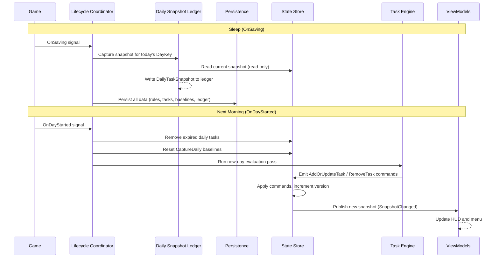
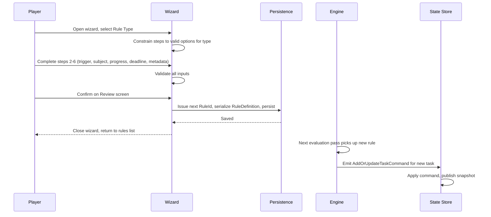
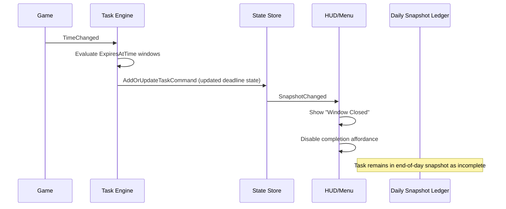

# Core Flows Spec Example

## Purpose

This spec defines seven flows identified as missing or contradictory in the design guide gap analysis (spec:56d7679a-8c78-417b-9405-c20206d91e73/1b5bd1c5-b76b-4769-99f8-0a47381015b1). Each flow records agreed decisions and the normative behavior to reflect in the design guide.

These flows are **product-level decisions** (what users experience and what behavior is required), not implementation detail checklists. They feed directly into updates for Sections 02, 04, 06, 07, 08, 09, 10, 10A, 11, 12, 14, and 20.

---

## Flow 1 — Day-Start and Sleep Lifecycle Ownership

### 1.1 What this flow defines

The authoritative sequence of events across the sleep-to-new-day boundary, with explicit layer ownership for each step. This resolves GAP-08 (day-start ownership) and GAP-25 (snapshot capture timing).

### 1.2 Decisions recorded

- **Snapshot capture timing:** The previous day's snapshot is captured at **sleep time** (`OnSaving`), not at the start of the next day. This ensures the snapshot reflects the true final state of the day including any last-minute completions.
- **Layer ownership:** The State Store owns both expired-task removal and daily baseline reset. The engine owns only evaluation. The Lifecycle Coordinator forwards signals in order without owning any data.
- **Bootstrap guardrail:** Time-context initialization must occur before any projection-triggering behavior. If violated, debug policy fails fast; release policy no-ops with deduplicated warning per active session.
- **Day-transition UI reset:** On each new day, HUD/menu local UI state resets to defaults (selection, scroll, expanded/collapsed state, temporary panel state).

### 1.3 Sleep flow (OnSaving)

**Trigger:** Player goes to bed. The game fires `OnSaving`.

1. The Lifecycle Coordinator receives the `OnSaving` signal and forwards it.
2. The **Daily Snapshot Ledger** captures the current task snapshot from the State Store, keyed to today's `DayKey`. This is the authoritative end-of-day record.
3. The snapshot is written to the ledger. The ledger is now complete for this day.
4. The persistence layer writes all pending data to disk: rules, manual tasks, baselines, user state, and the updated ledger.
5. No UI update occurs — the player is in the sleep/save flow.

### 1.4 New-day flow (OnDayStarted)

**Trigger:** The game fires `OnDayStarted` the following morning.

1. The Lifecycle Coordinator receives `OnDayStarted` and forwards it in order.
2. The **State Store** removes all expired daily tasks (tasks whose `DayKey` no longer matches today).
3. The **State Store** resets daily baselines for all rules with `BaselineMode: CaptureDaily`. Baselines are cleared; the engine will re-capture them during evaluation.
4. The **Task Engine** runs the new-day evaluation pass: built-in generators, Task Builder rules, and carry-forward persistent tasks are all evaluated against the new `DayKey`.
5. The engine emits `AddOrUpdateTaskCommand` and `RemoveTaskCommand` objects to the State Store.
6. The **State Store** applies all commands and publishes a refreshed snapshot.
7. **View Models** receive the new snapshot via the `SnapshotChanged` event and update the HUD and menu.
8. HUD/menu local UI state is reset to daily defaults for the new day.

### 1.5 Mid-day reload behavior

If the player reloads a save mid-day (e.g., after a crash), the `OnSaveLoaded` path runs instead. Daily baselines are re-captured during the first evaluation pass. Progress for the day resets to zero. This is accepted V1 behavior and is not a bug.



#### Layer ownership table

<!-- markdownlint-disable -->

| Step | Owning Layer | Notes |
| --- | --- | --- |
| Forward `OnSaving` signal | Lifecycle Coordinator | Signal-only, no data ownership |
| Capture end-of-day snapshot | Daily Snapshot Ledger | Reads from State Store snapshot; writes to ledger |
| Persist all data to disk | Persistence | Includes ledger, rules, baselines, user state |
| Forward `OnDayStarted` signal | Lifecycle Coordinator | Signal-only, ordered forwarding |
| Remove expired daily tasks | State Store | Owns task expiration; emits no external commands |
| Reset daily baselines | State Store | Clears `CaptureDaily` baseline values |
| Run new-day evaluation | Task Engine | Evaluates all sources; emits commands to store |
| Publish refreshed snapshot | State Store | After all commands applied |
| Update UI | View Models | Receive snapshot via event; no direct store access |

<!-- markdownlint-restore -->

## Flow 2 — Completed-Task Presentation

### 2.1 What this flow defines

How completed tasks appear in the HUD and menu, how long they remain visible, where they sort, and how the "show completed" toggle works. This resolves GAP-09 (ordering), the parking lot Finding 9 (completed-task presentation), and clarifies the snapshot model.

### 2.2 Decisions recorded

- **Snapshot content:** The State Store snapshot always contains **all tasks** — both incomplete and completed. Filtering is a view model responsibility, not a store responsibility.
- **Visibility duration:** Completed tasks remain in the active task list **until the day transitions**. They are never removed mid-day by completion alone.
- **Toggle behavior (V1):** The HUD "show completed tasks" toggle is **always on** in V1. The configurable toggle is deferred to a later version. Completed tasks are always visible in the HUD in V1.
- **Sort position:** Completion status is the **first sort key**. Completed tasks always sort below all incomplete tasks, regardless of pin state or task-type rank. A pinned completed task sorts below all incomplete tasks but above other completed tasks.

### 2.3 Sort order chain (updated)

The full deterministic ordering chain, with completion status added as the primary key:

1. **Completion status** — Incomplete tasks first, completed tasks last
2. **Pin state** — Within each completion group, pinned tasks sort first
3. **Task-type rank** — Within pinned/unpinned groups, the in-code ordering map applies
4. **Task Creation Day** — Fallback within the same type rank
5. **Canonical TaskId** — Final tiebreaker

### 2.4 HUD completed-task presentation

When a task completes during the day:

1. The engine or UI dispatches a `CompleteTaskCommand` to the State Store.
2. The State Store updates the task's status to `Completed` and publishes a new snapshot.
3. The HUD view model receives the snapshot and reconciles its collection.
4. The completed task moves to the bottom of the task list (below all incomplete tasks), with a visual "done" state (strikethrough title, muted color, checkmark icon).
5. The task remains visible in this position until the day transitions.
6. At day transition, the State Store removes the completed daily task as part of expiration. Completed persistent tasks remain in the list (still completed) until the rule no longer produces them or the player removes them.

### 2.5 Menu completed-task presentation

The menu's Tasks section (split list + detail view) follows the same sort order. Completed tasks appear at the bottom of the left-panel task list with the same visual "done" state. Selecting a completed task shows its detail in the right panel, including completion timestamp if available.

<style>
  body { font-family: monospace; background: #1a1a1a; color: #ccc; margin: 0; padding: 16px; }
  .hud { width: 260px; border: 1px solid #555; padding: 8px; background: #222; }
  .hud-title { font-size: 11px; color: #888; border-bottom: 1px solid #444; padding-bottom: 4px; margin-bottom: 6px; letter-spacing: 1px; }
  .task-row { padding: 4px 6px; margin-bottom: 3px; border-left: 2px solid #666; font-size: 12px; }
  .task-row.incomplete { border-left-color: #7ab; }
  .task-row.pinned { border-left-color: #fa0; }
  .task-row.completed { border-left-color: #555; color: #666; text-decoration: line-through; }
  .task-label { display: flex; justify-content: space-between; }
  .check { font-size: 10px; }
  .section-divider { font-size: 10px; color: #555; margin: 6px 0 4px; border-top: 1px dashed #444; padding-top: 4px; }
  .legend { margin-top: 12px; font-size: 10px; color: #666; }
</style>
<div class="hud">
  <div class="hud-title">▣ JOJA AUTOTASKS — Today</div>

  <div class="task-row pinned">
    <div class="task-label"><span>📌 Attend Luau Festival</span><span class="check">○</span></div>
  </div>
  <div class="task-row incomplete">
    <div class="task-label"><span>Water crops (12)</span><span class="check">○</span></div>
  </div>
  <div class="task-row incomplete">
    <div class="task-label"><span>Pet animals</span><span class="check">○</span></div>
  </div>
  <div class="task-row incomplete">
    <div class="task-label"><span>Collect 300 wood [120/300]</span><span class="check">○</span></div>
  </div>

  <div class="section-divider">── Completed ──────────────────</div>

  <div class="task-row completed">
    <div class="task-label"><span>✓ Harvest crops (8)</span><span class="check">✓</span></div>
  </div>
  <div class="task-row completed">
    <div class="task-label"><span>✓ Collect from machines</span><span class="check">✓</span></div>
  </div>
</div>
<div class="legend">
  Sort order: Incomplete first → Completed last</b>
  Within incomplete: Pinned → Type rank → Creation day → ID<br>
  Completed tasks remain until day transition
</div>

#### Edge cases

| Scenario | Behavior |
| --- | --- |
| Persistent task completed today | Remains in list (completed, bottom) until day transition; reappears as incomplete next day if rule still applies |
| Daily task completed today | Remains in list (completed, bottom) until day transition; removed at day-start expiration |
| Manual task completed | Remains in list (completed, bottom) until player explicitly removes it or day transitions |
| Task auto-completed by engine mid-day | Moves to bottom immediately when snapshot is published; no animation required in V1 |

## Flow 3 — Wizard Rule Type Mapping

### 3.1 What this flow defines

How the four wizard-facing Rule Types (Reminder, Progress, Repeating, Milestone) map to the engine's serialization model, how `RuleId` is generated, and what happens when a player edits an existing rule. This resolves GAP-03 (RuleId type), GAP-14 (rule type mapping), and GAP-20 (edit flow).

### 3.2 Decisions recorded

- **RuleId type:** Auto-incrementing integer counter, identical in pattern to `ManualTaskCounter`. The value-object wraps a numeric string internally. Serialized as an integer in JSON. The counter is persisted in `StoreUserState`.
- **Reminder + Daily:** The Reminder rule type supports both Persistent and Daily persistence. A daily reminder (e.g., "check crab pots every day") uses `Persistence: Daily`.
- **Milestone:** A wizard UX label for a Progress rule with an optional deadline. At the engine level it serializes as `TaskType: Progress` with a `Deadline` field populated. No distinct engine type.
- **Identity-affecting edits:** The engine attempts progress carryover if the progress model is compatible (same `TaskType`, same `SubjectId`). If incompatible, the old task is removed and a fresh task is generated.

#### Rule Type → Engine mapping

| Wizard Rule Type | Engine TaskType | Engine Persistence | Deadline | Notes |
| --- | --- | --- | --- | --- |
| **Reminder** | Reminder | Persistent | Optional | One-time date/time reminder |
| **Reminder (daily)** | Reminder | Daily | — | Recurring daily reminder; resets each day |
| **Progress** | Progress | Persistent | Optional | Goal that persists until target reached |
| **Repeating** | Progress | Daily | — | Daily goal; resets each day with new day-keyed TaskId |
| **Milestone** | Progress | Persistent | Required | Long-term goal; wizard enforces deadline entry |

### 3.3 RuleId generation flow

**Trigger:** Player completes the wizard and confirms rule creation.

1. The wizard collects all step data and assembles a partial `RuleDefinition`.
2. On confirmation, the system issues the next `RuleId` from the `RuleIdCounter` (same pattern as `ManualTaskCounter`).
3. The `RuleId` is assigned to the `RuleDefinition`. It never changes after this point.
4. The `RuleDefinition` is serialized and written to persistence.
5. The `RuleIdCounter` is incremented and persisted.
6. The engine picks up the new rule on the next evaluation pass and generates the first task instance.

### 3.4 Wizard creation flow

**Entry point:** Player opens the Task Builder section of the menu and taps "Create New Rule."

1. The wizard opens at Step 1: **Rule Type selection** (Reminder / Progress / Repeating / Milestone).
2. The player selects a rule type. The wizard constrains subsequent steps to valid options for that type.
3. **Step 2 — Trigger:** Player selects when the rule activates (day start, inventory change, time of day, calendar event, etc.).
4. **Step 3 — Subject:** Player selects what the rule tracks (specific item, skill, machine type, resource count, etc.).
5. **Step 4 — Progress / Completion:** Player defines the target (quantity, level, date). For Reminder types, this step defines the trigger condition instead.
6. **Step 5 — Deadline / Schedule** _(conditional)_: Shown for Milestone and deadline-bearing Progress rules. Player picks a due date.
7. **Step 6 — Metadata:** Player sets the task display name, optional description, category, and icon.
8. **Step 7 — Review:** A summary screen shows the full rule definition and a preview of how the task will appear in the HUD. A sentence-builder preview ("When I have 300 wood, mark Collect Wood as complete") is shown.
9. Player confirms. The rule is saved, a `RuleId` is issued, and the wizard closes.
10. The menu returns to the Task Builder rules list, where the new rule appears immediately.



### 3.5 Rule editing flow

**Entry point:** Player selects an existing rule in the Task Builder list and taps "Edit."

1. The wizard opens pre-populated with the existing rule's data.
2. The player modifies one or more steps.
3. On the Review screen, the wizard determines whether the edit is **metadata-only** or **identity-affecting**:

- **Metadata-only** (title, description, category, icon changed): No warning. The existing task is updated in-place on confirmation. Progress and completion state are preserved.
- **Identity-affecting** (trigger, subject, or progress model changed in a way that alters the `TaskId`): The Review screen shows a notice: _"This change will reset the task's progress. Your previous progress cannot be carried over."_ The player must explicitly confirm.

1. Player confirms. The rule definition is updated in persistence.
2. On the next evaluation pass, the engine attempts progress carryover:

- If the new rule produces the same `TaskType` and `SubjectId` as the old rule, the engine carries over `ProgressCurrent` from the existing task record.
- If the `TaskType` or `SubjectId` changed, the old task is removed via `RemoveTaskCommand` and a fresh task is generated with zero progress.

<html>
<style>
  body { font-family: monospace; background: #1a1a1a; color: #ccc; margin: 0; padding: 16px; }
  .wizard { width: 420px; border: 1px solid #555; background: #222; }
  .wizard-header { background: #2a2a2a; padding: 10px 14px; border-bottom: 1px solid #444; font-size: 13px; }
  .step-bar { display: flex; gap: 4px; padding: 8px 14px; border-bottom: 1px solid #333; }
  .step { font-size: 10px; padding: 2px 6px; border: 1px solid #444; color: #666; }
  .step.active { border-color: #7ab; color: #7ab; }
  .step.done { border-color: #555; color: #555; background: #2a2a2a; }
  .wizard-body { padding: 14px; }
  .review-section { margin-bottom: 10px; }
  .review-label { font-size: 10px; color: #888; margin-bottom: 2px; }
  .review-value { font-size: 12px; color: #ccc; padding: 4px 8px; background: #1a1a1a; border: 1px solid #333; }
  .preview-task { margin: 10px 0; padding: 6px 10px; border-left: 2px solid #7ab; background: #1a1a1a; font-size: 12px; }
  .sentence { font-size: 11px; color: #8ab; font-style: italic; margin: 8px 0; }
  .warning { font-size: 11px; color: #fa8; background: #2a1a00; border: 1px solid #a60; padding: 6px 8px; margin: 8px 0; }
  .btn-row { display: flex; gap: 8px; margin-top: 12px; }
  .btn { font-size: 11px; padding: 5px 14px; border: 1px solid #555; background: #2a2a2a; color: #ccc; cursor: pointer; }
  .btn.primary { border-color: #7ab; color: #7ab; }
</style>
</head>
<body>
<div class="wizard">
  <div class="wizard-header">✦ Task Builder — Review &amp; Confirm</div>
  <div class="step-bar">
    <div class="step done">1 Type</div>
    <div class="step done">2 Trigger</div>
    <div class="step done">3 Subject</div>
    <div class="step done">4 Progress</div>
    <div class="step done">5 Deadline</div>
    <div class="step done">6 Metadata</div>
    <div class="step active">7 Review</div>
  </div>
  <div class="wizard-body">
    <div class="review-section">
      <div class="review-label">RULE TYPE</div>
      <div class="review-value">Progress → Persistent</div>
    </div>
    <div class="review-section">
      <div class="review-label">TRIGGER</div>
      <div class="review-value">Inventory change (Wood)</div>
    </div>
    <div class="review-section">
      <div class="review-label">TARGET</div>
      <div class="review-value">Collect 300 more Wood from current inventory</div>
    </div>
    <div class="review-section">
      <div class="review-label">TASK PREVIEW</div>
      <div class="preview-task">Collect 300 Wood &nbsp;[0 / 300]</div>
    </div>
    <div class="sentence">"When I have collected 300 more wood, mark Collect 300 Wood as complete."</div>
    <div class="warning">⚠ This change will reset the task's progress. Your previous progress cannot be carried over.</div>
    <div class="btn-row">
      <div class="btn">← Back</div>
      <div class="btn">Cancel</div>
      <div class="btn primary" data-element-id="confirm-btn">Confirm Rule</div>
    </div>
  </div>
</div>
</body>

### Progress carryover decision table

| Old TaskType | New TaskType | Old SubjectId | New SubjectId | Outcome |
| --- | --- | --- | --- | --- |
| Progress | Progress | Same | Same | Carry over `ProgressCurrent`; task updated in-place |
| Progress | Progress | Same | Different | Remove old task; fresh task with zero progress |
| Progress | Reminder | Any | Any | Remove old task; fresh task (incompatible types) |
| Reminder | Reminder | Same | Same | Update in-place; no progress to carry |
| Any | Any | Changed | Changed | Remove old task; fresh task with zero progress |

## Flow 4 — Toast Notification System

### 4.1 What this flow defines

How the mod notifies the player when a task auto-completes, using the game's native `HUDMessage` banner system while preserving the "no direct game API access from subsystem view-models" boundary. This resolves GAP-13 (toast system has no view model contract in Section 10A).

### 4.2 Decisions recorded

- **Notification mechanism:** The mod uses the game's native `HUDMessage` banner API rather than building a custom toast UI.
- **Boundary ownership:** Subsystem view-models do **not** call game APIs directly. The HUD host/adapter owns the `ToastRequested` subscription, forwards toast data into `HudViewModel` intent mapping, and performs the game API call.
- **Trigger mechanism:** The State Store fires a dedicated `ToastRequested` event alongside `SnapshotChanged`. `ToastRequested` carries a `ToastEvent` payload.
- **Idempotency rule:** `ToastRequested` fires only on a true status transition (`Incomplete → Completed`) with `IsPlayerInitiated = false`.
- **V1 trigger:** Only **task auto-completion** (engine-driven completion, not player-initiated checkbox click) triggers a toast in V1. All other triggers (rule first activates, reminder fires, daily summary) are deferred to V2.

### 4.3 Toast trigger flow

**Trigger:** The Task Engine evaluates a rule and determines a task has met its completion condition without player input.

1. The engine emits a `CompleteTaskCommand` to the State Store.
2. The State Store applies the command.
3. If the task status changed from `Incomplete` to `Completed` and `IsPlayerInitiated = false`, the State Store fires `ToastRequested`.
4. The HUD host/adapter receives `ToastRequested` and forwards the payload to `HudViewModel` for intent mapping.
5. `HudViewModel` emits a UI notification intent to the HUD host/adapter layer.
6. The HUD host/adapter calls the native `HUDMessage` API with formatted text (e.g., _"✓ Harvest crops — Complete!"_).
7. The native game notification system displays and auto-dismisses the banner.
8. The State Store also fires `SnapshotChanged`; the UI reconciles the completed task row.

**Player-initiated completion** (HUD/menu clicks or future bulk-complete actions) does **not** trigger a toast.

```mermaid
sequenceDiagram
    participant Engine as Task Engine
    participant Store as State Store
    participant Host as HUD Host/Adapter
  participant HudVM as HudViewModel
    participant Game as Native HUDMessage

    Engine->>Store: CompleteTaskCommand (auto-completion)
    Store->>Store: Apply command; verify transition Incomplete->Completed
  Store->>Host: ToastRequested (TaskAutoCompleted, title)
  Host->>HudVM: Forward toast payload
  HudVM->>Host: Notification intent (title, type)
    Store->>HudVM: SnapshotChanged
    Host->>Game: Show banner message
    Game-->>Game: Queue + auto-dismiss
```

### 4.4 ToastEvent payload

`ToastEvent`

- `Type` — ToastType enum (TaskAutoCompleted; V2 may add others)
- `TaskTitle` — string (task display title at completion time)

### 4.5 State Store event contract

`public event Action<ToastEvent>? ToastRequested;`

`ToastRequested` is fired only when all conditions are true:

- `CompleteTaskCommand.IsPlayerInitiated == false`
- `Prior task status == Incomplete`
- `New task status == Completed`

### 4.6 V1 scope boundary

| Toast trigger                       | V1 status   | Notes              |
| ----------------------------------- | ----------- | ------------------ |
| Task auto-completes (engine-driven) | ✅ Required | Core feedback loop |
| Task Builder rule first activates   | ⏳ V2       | Deferred           |
| Manual task reminder fires          | ⏳ V2       | Deferred           |
| Daily summary captured              | ⏳ V2       | Deferred           |

### 4.7 View model / UI host contract additions (Section 10A.5)

`HudViewModel` (additions)

- Converts toast payload from the host/adapter into a UI notification intent
- Does NOT call game APIs directly

Hud UI host/adapter (additions)

- Subscribes to State Store `ToastRequested` event
- Forwards toast payload to `HudViewModel`
- Receives notification intents from `HudViewModel`
- Calls native `HUDMessage` API
- No custom toast queue in V1 (native system handles queuing)
- Unsubscribes from `ToastRequested` on disposal

No `ToastViewModel` class is needed in V1.

---

## Flow 5 — History Data Access Pattern

### 5.1 What this flow defines

How the `HistoryViewModel` accesses the Daily Snapshot Ledger, what the History section's navigation UX looks like, and how edge cases (missing days, boundary navigation) are handled. This resolves GAP-19 (HistoryViewModel has no defined data source contract).

### 5.2Decisions recorded

- **Ledger access:** `HistoryViewModel` receives an `IDailySnapshotLedger` interface via constructor injection. The ledger is read-only from the view model's perspective.
- **Navigation UX (V1):** Previous/Next day arrow buttons only. The current day label is shown between the arrows (e.g., "Spring 12, Year 2"). No calendar picker, no jump-to, no scrollable day list in V1.
- **Task list display (V1):** Minimal list — task title + completion status (✓ or ○) only. No progress bar, no category icon in V1. A richer split-panel view (Option C from the design discussion) is explicitly documented as a V2 target.
- **Boundary behavior:** Navigation arrows are disabled when the player reaches the most recent recorded day (yesterday). The player cannot navigate to today or future days from the History section.
- **Missing day behavior:** For past days with no ledger entry (e.g., mod installed mid-save), the task list area shows a "No data recorded for this day" message. The navigation arrows remain enabled so the player can skip past the gap.

### 5.3 IDailySnapshotLedger interface

`IDailySnapshotLedger`

|  |  |  |  |
| --- | :-: | --- | --- |
| `GetSnapshot(DayKey)` | `→` | `DailyTaskSnapshot?` | `null` if no entry for thatday |
| `GetRecordedDays()` | `→` | `IReadOnlyList<DayKey>` | All days with ledger entries, newest first |
| `MostRecentDay` | `→` | `DayKey?` | `null` if ledger is empty |

The ledger is injected into `HistoryViewModel` at construction time. It is never written to from the view model.

### History navigation flow

**Entry point:** Player opens the menu and navigates to the History tab.

1. The `HistoryViewModel` initializes with `SelectedDayKey` set to `IDailySnapshotLedger.MostRecentDay`.
2. If the ledger is empty (first day of play, mod just installed), the History section shows a "No history recorded yet" empty state. Both navigation arrows are disabled.
3. The current day label displays the selected day in human-readable format (e.g., "Spring 12, Year 2").
4. The task list shows all tasks recorded for the selected day — title and completion status only.
5. The player taps the **← Previous** arrow to go one day earlier:

- `SelectedDayKey` decrements by one in-game day.
- The task list updates to show the new day's data.
- If the new day has no ledger entry, the task list shows "No data recorded for this day."
- The **→ Next** arrow becomes enabled (the player is no longer at the most recent day).

1. The player taps the **→ Next** arrow to go one day forward:

- `SelectedDayKey` increments by one in-game day.
- The **→ Next** arrow disables again when the player reaches `MostRecentDay`.

### Navigation boundary rules

| Condition | ← Previous arrow | → Next arrow |
| --- | --- | --- |
| Ledger is empty | Disabled | Disabled |
| Viewing most recent recorded day | Enabled (if earlier days exist) | Disabled |
| Viewing an intermediate day | Enabled | Enabled |
| Viewing the earliest possible day (Day 1, Year 1) | Disabled | Enabled |

### Missing day handling

When `GetSnapshot(DayKey)` returns `null`:

- The task list area shows: _"No data recorded for this day."_
- The day label still shows the selected day (so the player knows where they are).
- Navigation arrows follow the same boundary rules — the player can continue navigating past the gap.
- The mod does **not** attempt to reconstruct or infer history for missing days.

### V2 upgrade path (documented for future reference)

The V1 minimal list (title + status only) is intentionally simple. The V2 History section upgrade is:

- **Split-panel layout:** Left panel shows a scrollable list of recorded days (most recent first). Clicking a day loads its task list in the right panel.
- **Full task rows:** Title, category icon, progress bar (e.g., "5/5 trees"), completion status — same visual style as the live Tasks section.
- **Detail panel:** Selecting a historical task shows its full detail in a right panel.

This upgrade path is documented here so it is not forgotten and so the `IDailySnapshotLedger.GetRecordedDays()` method is included in the V1 interface contract (it will be needed for the V2 day list).

<!DOCTYPE html>
<html>
<head>
<style>
  body { font-family: monospace; background: #1a1a1a; color: #ccc; margin: 0; padding: 16px; }
  .menu { width: 480px; border: 1px solid #555; background: #222; }
  .menu-header { background: #2a2a2a; padding: 10px 14px; border-bottom: 1px solid #444; font-size: 13px; }
  .tab-bar { display: flex; border-bottom: 1px solid #444; }
  .tab { font-size: 11px; padding: 6px 14px; color: #666; border-right: 1px solid #333; cursor: pointer; }
  .tab.active { color: #7ab; border-bottom: 2px solid #7ab; background: #1e2a2a; }
  .menu-body { padding: 14px; }
  .nav-row { display: flex; align-items: center; justify-content: space-between; margin-bottom: 12px; }
  .nav-btn { font-size: 12px; padding: 4px 12px; border: 1px solid #555; background: #2a2a2a; color: #ccc; cursor: pointer; }
  .nav-btn.disabled { color: #444; border-color: #333; cursor: default; }
  .day-label { font-size: 13px; color: #aaa; }
  .task-list { border: 1px solid #333; background: #1a1a1a; }
  .task-row { display: flex; justify-content: space-between; padding: 5px 10px; border-bottom: 1px solid #2a2a2a; font-size: 12px; }
  .task-row:last-child { border-bottom: none; }
  .task-row.done { color: #666; text-decoration: line-through; }
  .status { font-size: 11px; }
  .empty-state { padding: 20px; text-align: center; color: #555; font-size: 12px; font-style: italic; }
  .v2-note { margin-top: 10px; font-size: 10px; color: #555; font-style: italic; }
</style>
</head>
<body>
<div class="menu">
  <div class="menu-header">✦ Joja AutoTasks</div>
  <div class="tab-bar">
    <div class="tab">Tasks</div>
    <div class="tab">Task Builder</div>
    <div class="tab active">History</div>
    <div class="tab">Config</div>
    <div class="tab">Debug</div>
  </div>
  <div class="menu-body">
    <div class="nav-row">
      <div class="nav-btn">← Previous</div>
      <div class="day-label">Spring 12, Year 2</div>
      <div class="nav-btn disabled">Next →</div>
    </div>
    <div class="task-list">
      <div class="task-row"><span>Water crops (12)</span><span class="status">○</span></div>
      <div class="task-row done"><span>Harvest crops (8)</span><span class="status">✓</span></div>
      <div class="task-row done"><span>Collect from machines</span><span class="status">✓</span></div>
      <div class="task-row done"><span>Pet animals</span><span class="status">✓</span></div>
      <div class="task-row"><span>Collect 300 wood [120/300]</span><span class="status">○</span></div>
    </div>
    <div class="v2-note">V2: Split-panel layout with day list + full task rows + detail panel</div>
  </div>
</div>
</body>
</html>

### HistoryViewModel catalog entry (Section 10A.5 addition)

`HistoryViewModel`

- Receives `IDailySnapshotLedger` via constructor injection
- Owns SelectedDayKey (UI-local state, not persisted)
- Initializes SelectedDayKey to `IDailySnapshotLedger.MostRecentDay`
- Exposes: `DayLabel` (string), Tasks (`IReadOnlyList<HistoricalTaskRowViewModel>`)
- Exposes: `CanGoPrevious` (bool), `CanGoNext` (bool)
- Commands: `GoToPreviousDay`(), `GoToNextDay`()
- On day change: calls `GetSnapshot(SelectedDayKey)`; if null, exposes empty list + `NoDataMessage`
- Read-only access to ledger; never writes or modifies historical records

`HistoricalTaskRowViewModel`

- Fields: `Title` (string), `IsCompleted` (bool)
- V1 only — no progress bar, no category icon
- V2 upgrade: add `ProgressCurrent`, `ProgressTarget`, `CategoryIcon`, detail panel support

## Flow 6 — CompleteTaskCommand Origin Contract

### 6.1 What this flow defines

The normative boundary between player-initiated and engine-driven task completion, and how `CompleteTaskCommand` communicates that origin to the State Store so toast behavior stays deterministic and non-spammy.

### 6.2 Decisions recorded

- **IsPlayerInitiated boundary:** `true` for any completion dispatched from UI interactions (HUD, menu, and future bulk actions). `false` only for engine-dispatched completion from rule evaluation.
- **Default value:** `IsPlayerInitiated` defaults to `false`.
- **Idempotency:** Toast behavior is transition-based, not command-based. Replaying a completion command against an already completed task does not emit another toast.

### 6.3 Completion origin flow

**Path A — Player-initiated completion:**

1. Player triggers completion from HUD/menu.
2. UI dispatches `CompleteTaskCommand(CompletionDay = currentDay, IsPlayerInitiated = true)`.
3. State Store applies state update.
4. `ToastRequested` does not fire.
5. `SnapshotChanged` publishes updated UI state.

**Path B — Engine-driven completion:**

1. Engine rule evaluation determines completion condition is met.
2. Engine dispatches `CompleteTaskCommand(CompletionDay = currentDay, IsPlayerInitiated = false)`.
3. State Store applies state update.
4. If this caused `Incomplete → Completed`, `ToastRequested` fires once.
5. `SnapshotChanged` publishes updated UI state.

### 6.4 Updated CompleteTaskCommand contract

`CompleteTaskCommand`

- `TaskId` — `TaskId` (required)
- `CompletionDay` — DayKey (required)
- `IsPlayerInitiated` — bool (required; default false)

### 6.5 Section 08 additions

Section 8.6 (Command System) gains:

`CompleteTaskCommand` includes `CompletionDay` (`DayKey`, required) and `IsPlayerInitiated` (bool, default false). UI callers set `CompletionDay` = current day and `IsPlayerInitiated` = true. Engine callers set `CompletionDay` = current day and leave `IsPlayerInitiated` = false.

Section 8.12 (Snapshot Publishing) gains:

`ToastRequested` is emitted only when all are true:

- `IsPlayerInitiated` == false
- prior status == Incomplete
- new status == Completed

`ToastRequested` is emitted before `SnapshotChanged`.

## Flow 7 — DeadlineFields Model and Time-Window Validity

### 7.1 What this flow defines

The concrete structure of `DeadlineFields`, how deadline/time-window tasks are displayed, and how V1 handles tasks that become impossible to complete after an intra-day cutoff (festival-style windows). This resolves GAP-11 and aligns with the sleep-time history model.

### 7.2 Decisions recorded

- **Structure:** `DeadlineFields` has two stored fields (`DueDayKey`, optional `ExpiresAtTime`) and derived fields (`DaysRemaining`, `IsOverdue`, `IsWindowClosed`). Entire object is `null` when no deadline exists.
- **Display:** Deadline shown as inline suffix in HUD/menu title row (`3d`, `Today`, `OVERDUE`). Configurable display is a V2 consideration.
- **Overdue definition:** Due date is the last valid day. Overdue begins next day. Overdue does **not** affect sort order.
- **V1 behavior:** Deadline is display-first. No auto-fail status. Task remains in state as `Incomplete` unless completed.
- **Intra-day window closure:** If `ExpiresAtTime` is passed on `DueDayKey`, task remains in list/history as incomplete but becomes non-actionable in UI (completion controls disabled, "window closed" indicator shown).
- **Scope:** `ExpiresAtTime` is available in V1 for both built-in generators and Task Builder rules.
- **Ownership:** Task Engine is authoritative for time-window evaluation on time-change signals and emits commands when state changes. State Store only applies command-based mutations and does not independently publish window-state changes from time-change signals.
- **Guardrail inheritance:** Flow 1 bootstrap/session guardrails apply to time-change processing here as well (time-context must be initialized; out-of-session signals are ignored).

### 7.3 DeadlineFields structure

`DeadlineFields`

| Field Name | Type | Description |
| --- | --- | --- |
| `DueDayKey` | `DayKey` | (stored; last valid day) |
| `ExpiresAtTime` | `int?` | (stored; optional in-game time, e.g. 2200) |
| `DaysRemaining` | `int` | (derived; negative when overdue) |
| `IsOverdue` | `bool` | (derived; today > `DueDayKey`) |
| `IsWindowClosed` | `bool` | (derived; today == `DueDayKey` AND currentTime >= `ExpiresAtTime`) |

`DeadlineFields` is `null` when a task has no deadline.

### 7.4 HUD/menu display and interaction rules

| State | Display | Completion affordance |
| --- | --- | --- |
| Normal future deadline | `· 5d` | Enabled |
| Due today, window open | `· Today` or `· Until 10pm` | Enabled |
| Due today, window closed | `· Window Closed` | Disabled |
| Past due day | `· OVERDUE` | Disabled (for tasks with time-window semantics) |

For time-window tasks, once window is closed, player cannot mark complete manually in V1.

### 7.5 Time-window closure flow (festival pattern)

**Trigger:** In-game clock reaches/passes `ExpiresAtTime` on `DueDayKey`.

1. Engine receives time-change signal.
2. Engine evaluates tasks with `ExpiresAtTime` for current day.
3. If window closure state changed, engine emits `AddOrUpdateTaskCommand` (or `RemoveTaskCommand` where applicable).
4. State Store applies emitted command(s) and publishes snapshot update.
5. HUD/menu show "Window Closed" and disable completion controls.
6. Task remains present and incomplete, so sleep-time snapshot preserves it in history.



### 7.6 History consistency rule

Time-window-closed tasks are retained as incomplete records in the day snapshot ledger. No special expired status is introduced in V1.

### 7.7 Expiration behavior summary

| Behavior                               | V1  | V2 path      |
| -------------------------------------- | --- | ------------ |
| Day-based overdue indicator            | ✅  | Keep         |
| Intra-day window closed indicator      | ✅  | Keep         |
| Auto-remove on window close            | ❌  | Optional V2  |
| Day-boundary auto-remove after due day | ❌  | Optional V2  |
| Failed/Expired status enum             | ❌  | Optional V2+ |

### Section 04 additions (§4.10)

§4.10 Deadline Fields Model

Stored fields: `DueDayKey` `ExpiresAtTime?` (optional)

Derived fields: `DaysRemaining` `IsOverdue` `IsWindowClosed`

V1 rules:

- Deadline fields are display/interaction signals.
- No Failed status.
- Window-closed tasks remain incomplete and visible in HUD/menu/history.

## Design Guide Sections to Update

These flows directly resolve the following gaps from the gap analysis. Each section listed must be updated to reflect the decisions recorded here.

| Flow | Gap IDs resolved | Sections to update |
| --- | --- | --- |
| Flow 1 — Day-start ownership | GAP-08, GAP-25 | Section 02 §2.5, Section 12 §12.10, Section 12 §12.11 |
| Flow 2 — Completed-task presentation | GAP-09 (sort order), Parking lot Finding 9 | Section 04 §4.6, Section 10 §10.5, Section 10A §10A.5 |
| Flow 3 — Wizard rule type mapping | GAP-03, GAP-14, GAP-20 | Section 03 §3.7, Section 06 §6.3/6.8/6.10, Section 14 §14.4/14.16, Section 09 §9.8 |
| Flow 4 — Toast notification system | GAP-13 | Section 20 §20.8, Section 10A §10A.5; add UI host/adapter notification boundary; `ToastEvent` contract |
| Flow 5 — History data access pattern | GAP-19 | Section 10A §10A.5 (new §10A.12), Section 11 §11.8; new `IDailySnapshotLedger` interface |
| Flow 6 — CompleteTaskCommand origin | GAP-13 (contract closure) | Section 08 §8.6, Section 08 §8.12; `CompleteTaskCommand.CompletionDay` + `CompleteTaskCommand.IsPlayerInitiated`; transition-based toast idempotency rule |
| Flow 7 — DeadlineFields time-window validity | GAP-11 | Section 04 (new §4.10), Section 08 §8.4, Section 10 §10.4/§10.5, Section 11 §11.3, Section 12 §12.5; add `ExpiresAtTime` + `IsWindowClosed` behavior |
